# **Zacio**

At Zacio, our mission is to be more than just an event management agency. We strive to be the bridge between innovation and unforgettable experiences. We are dedicated to crafting cutting-edge events that leverage the power of technology to captivate audiences and achieve our clients' brand goals.

**Mission**

Central to our mission is our commitment to converse and celebrate with high-quality professionals, fostering authentic connections and facilitating meaningful experiences. We believe in creating environments where genuine interactions thrive, enabling individuals to connect, learn, and grow together.

Through our innovative approach and unwavering dedication, we aim to set new standards in event management, leaving a lasting impact on our clients, attendees, and the industry as a whole.

[Link to live project](https://smbiko.github.io/Zacio-project/index.html)

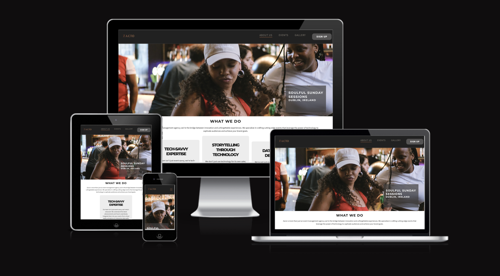

## **Table of contents**

- [**Zacio**](#Zacio)
  - [**Table of contents**](#table-of-contents)
  - [**Planning**](#planning)
    - [**External user goals**](#external-user-goals)
    - [**Site owner goals**](#site-owner-goals)
    - [**User Stories**](#user-stories)
    - [**Features to achieve the goals**](#features-to-achieve-the-goals)
    - [**Wireframes**](#wireframes)
    - [**Color Scheme**](#color-scheme)
    - [**Fonts**](#fonts)
    - [**Logo and Images**](#logo-and-images)
  - [**Features**](#features)
    - [**Header**](#header)
    - [**Footer**](#footer)
    - [**Home Page**](#home-page)
        - [**AboutUs**](#aboutus)
        - [**Portfolio Section**](#portfolio-section)
        - [**Team Section**](#team-section)
    - [**Events Page**](#events-page)
    - [**Gallery Page**](#gallery-page)
    - [**Sign Up Page**](#signup-page)
    - [**Custom 404 Page**](#custom-404-page)

## **Planning**

### **External user goals**

    - Find events in around Dublin
    - high quality productions of event
    - find like minded people

### **Site owner goals**

    - provide attendees with info about what events we put together 
    - get people to sign up for events

### **User Stories**

    - As a user, I want to navigate the website using multiple devices.
    - As a user, I want to find general information about the event company.
    - As a user, I want to find out which events are being produced.
    - As a user, I want to apply sign up for events .
    - As a user, I want to buy tickets to the events.
    - As a user, I want to see pictures of previous events .
    - As the site owner, I want to provide enough information about the events .
    - As the site owner, I want the user to also find the type of djs we have playing at our events
    - As the site owner, I want to get purchases through the website.

### **Features to achieve the goals**

    - The website will be built with a mobile-first approach, to ensure it is responsive. I will also test it on various devices and screen sizes.
    - General information about the events like the dates and address will be included in the events screen .
    - General information about the events social media links where users can find  pictures and past event videos will included in the footer  .
    - An sign up form with relevant information will be included on a separate page (Sign up).
    - On a separate page (Gallery) pictures will be included to show the attendees that took part in the past .
    - Call-to-action buttons will be used throughout the website to get sign ups

### **Wireframes**

I created wireframes to visualize my ideas using Figma (docs/wireframe/wireframe.png) . As I want to stick to the mobile-first approach I created wireframes for mobile, tablet and desktop screen sizes.

### **Color Scheme**

I have chosen a nice shade of Gold as the primary color of the brand and complemented it with black and grey. I also subtly altered the black and white colors from the their  maximum values, providing a more subtle contrast for smoother reading experience.

To create the color scheme I pictured a high class event and found that gold and silver was used quite alot to elavate the eligence . I quickly decided to go for gold as my main color and picked **#A06040** to be one of my main colors. Then I used http://colormind.io/to find matching colors for my scheme. After picking out my five main colors I used [contrast-grid.eightshapes.com](https://contrast-grid.eightshapes.com/?version=1.1.0&background-colors=&foreground-colors=%2383a603%0D%0A%231b4001%0D%0A%23f0deb4%0D%0A%23f6f7eb%0D%0A%23001e1d&es-color-form__tile-size=regular&es-color-form__show-contrast=aaa&es-color-form__show-contrast=aa&es-color-form__show-contrast=aa18&es-color-form__show-contrast=dnp) to check the contrast and possible color combinations.

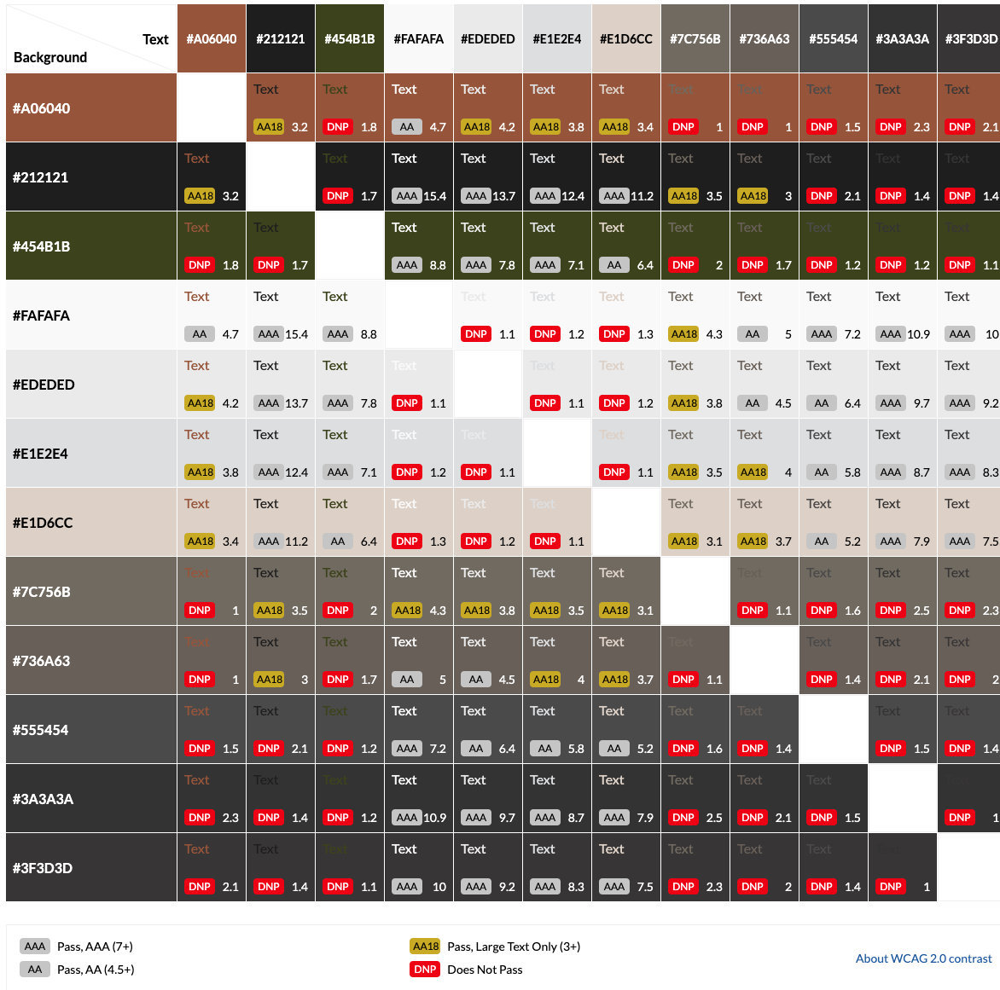

### **Fonts**

I’ve opted to use Montserrat as the main font for the website ,paired with Source Sans as the body text. The combination works well together, proviing a clean attractive style. In case of any importing issues, the default sans-serif on the users browser serves as a reliable fallback font.the result is a polished and cohesive design design that enhances the overall aesthetics and readability of the site.

### **Logo and Images**

After choosing my colors and fonts I wanted to make a simple Logo for my website.

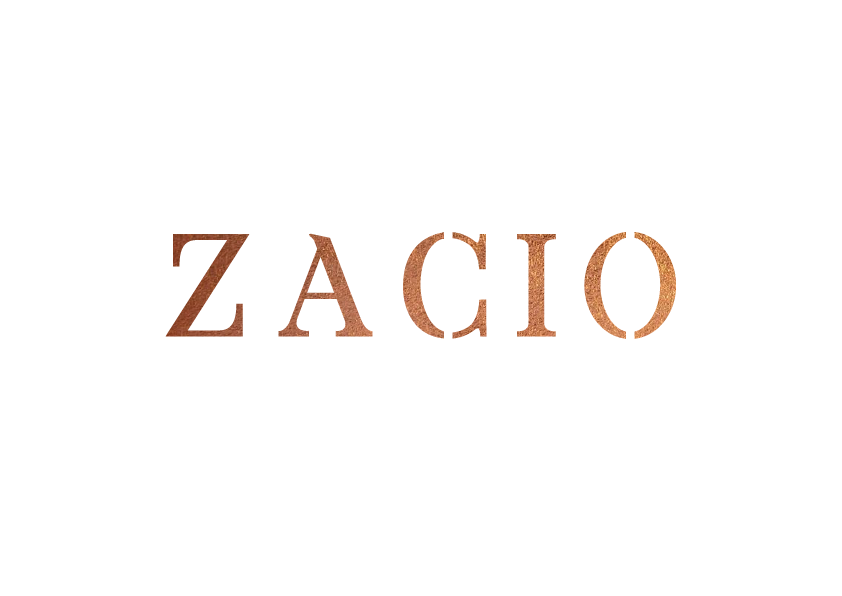

## **Features**

### **Navigation Bar**

To follow my mobile-first approach I started by looking at tutorials on how to implement a hamburger menu without JavaScript. I found a video with the according [Codepen](https://codepen.io/kevinpowell/pen/jxppmr) from Kevin Powell. I used the information from the video and example code in the Codepen for my navigation.

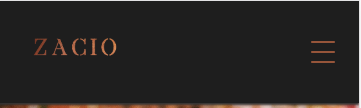

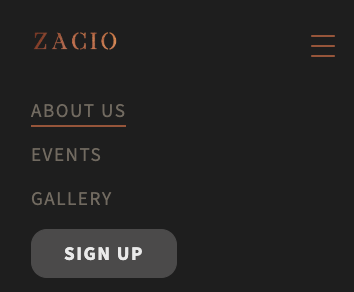

The navigation header is sticky to improve UX. This way the user can easily navigate the website and click on another page from anywhere. The navigation links have a `:hover` effect that is also used for the active page, as shown in the screenshot below.

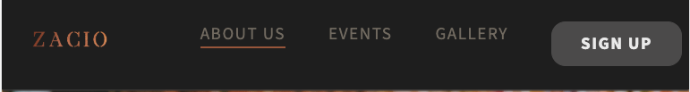

Below my navigation, I have a hero image on each page. On the *Home* page, the hero is bigger than on the other pages. I added an overlay on top of the hero images to make sure that the text is readable.

In this section, you should go over the different parts of your project, and describe each in a sentence or so. You will need to explain what value each of the features provides for the user, focusing on who this website is for, what it is that they want to achieve and how your project is the best way to help them achieve these things.

### **Footer**

The footer includes the the Facebook Youtube ,TikTok , X previously know as Twitter and Instagram pages are also linked in the Footer.  

## Home Page/About Us

### Services Section

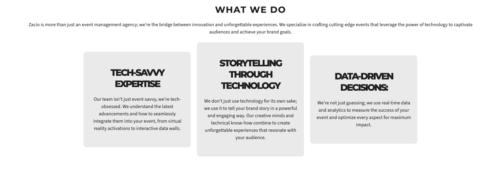

- The Services Section distinctly highlights each offering of the agency. Every service is presented in its own card, ensuring clarity. To ensure responsiveness, the cards adjust into columns as the viewport narrows.

### **Portfolio Section**

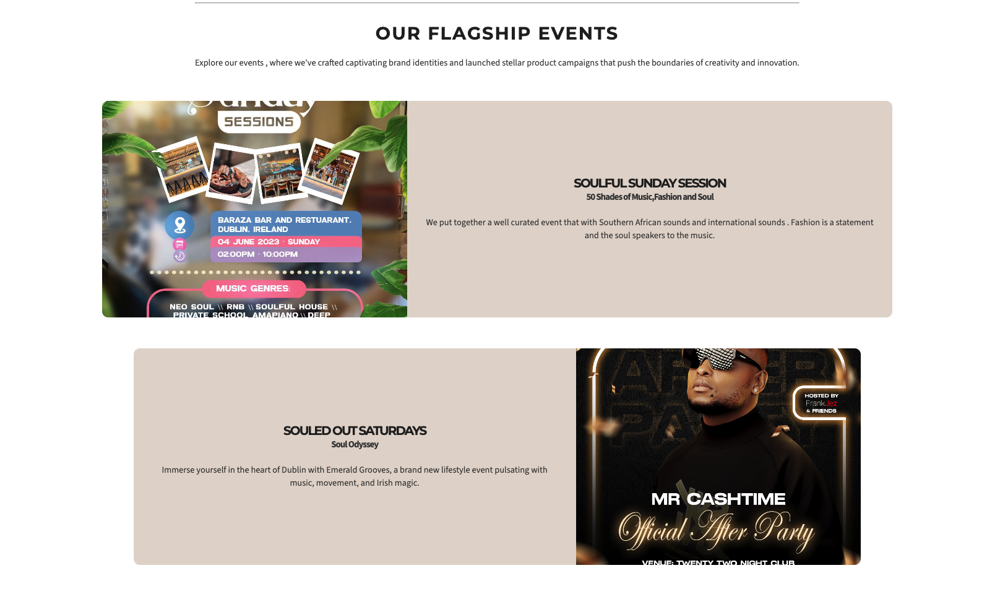

- The Portfolio Section showcases the company’s event catalogue. Each entry is features a visual of a past event with the theme and a small description of what the concept is about.

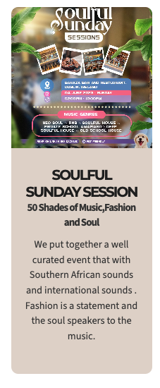

- Each card adapts tp position the  image above the text, ensuring a pleasant a readable experience on smaller mobile devices.

### **Team Section**

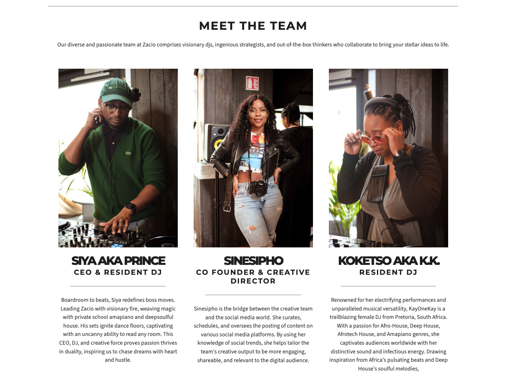

- The team section is arranged in grid format on larger screens, collapsing to accommodate smaller ones. Each team member is featured  in a full frontal profile shot, accompanied by a brief description of their role in the company.
    
    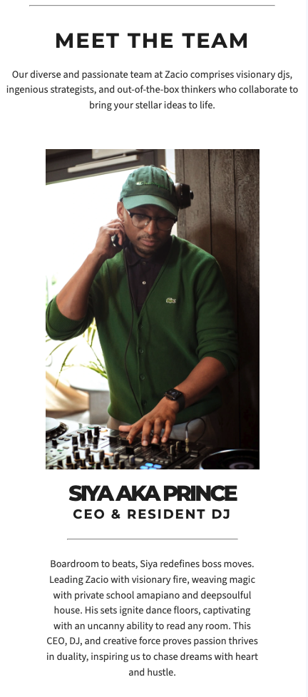
    

## **Event Page**

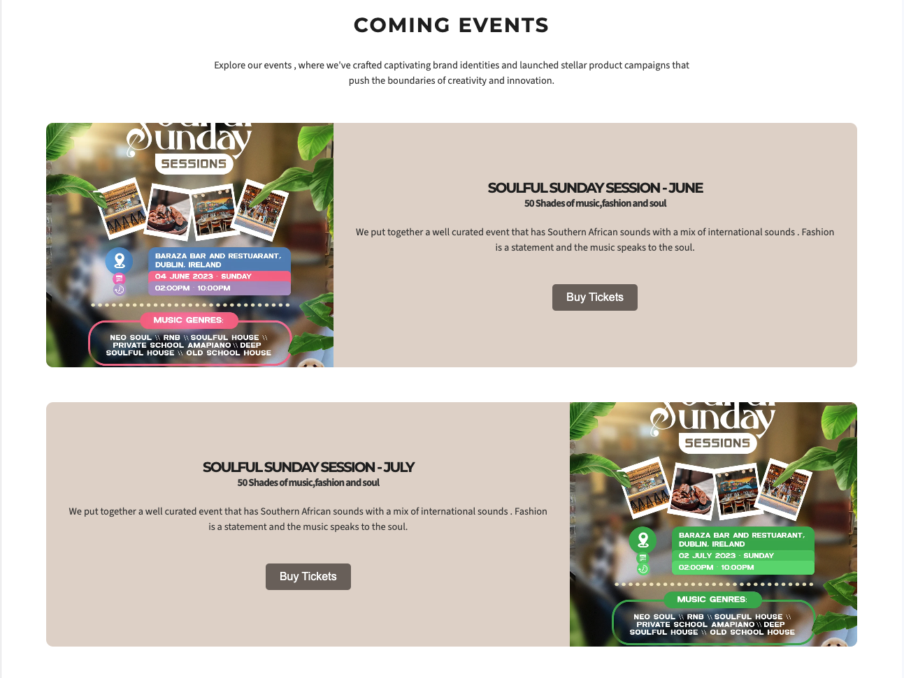

- Browse through a comprehensive list of upcoming events, each with detailed information including date, time, location, and description.
- Purchase tickets for events directly from the event page, with a link to Eventbrite.

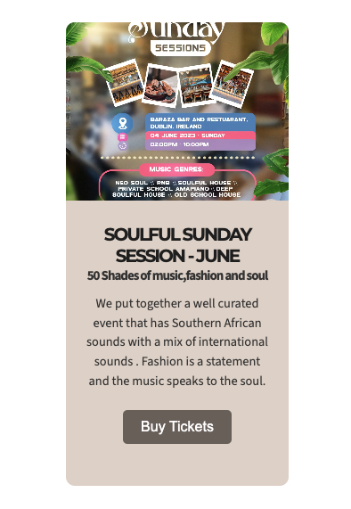

- Enjoy a seamless browsing experience on any device with responsive design, optimizing the event page layout for desktops, tablets, and smartphones.

## **Gallery Page**

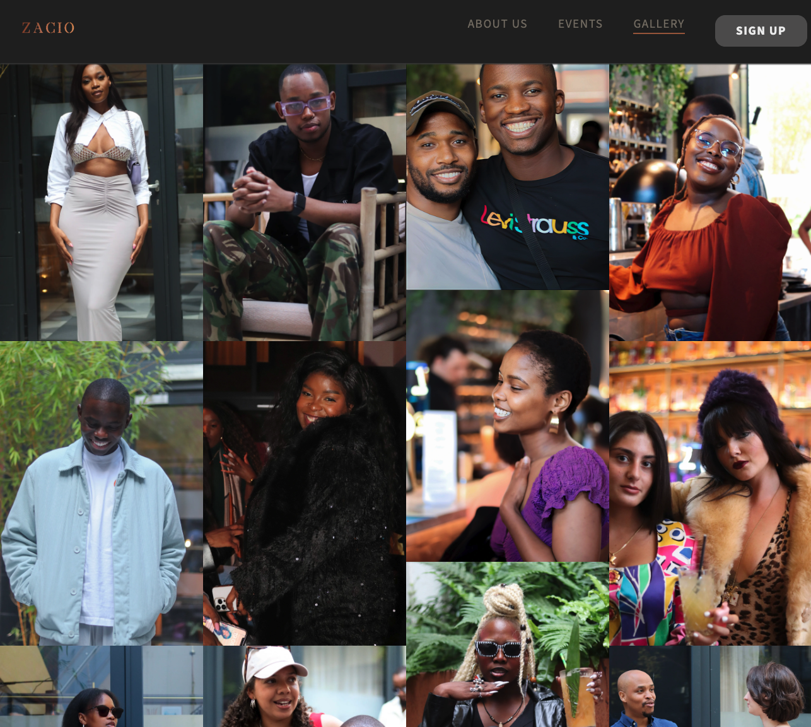

- Immerse yourself in a stunning visual showcase of captivating images that highlight the essence and aesthetic of Zacio

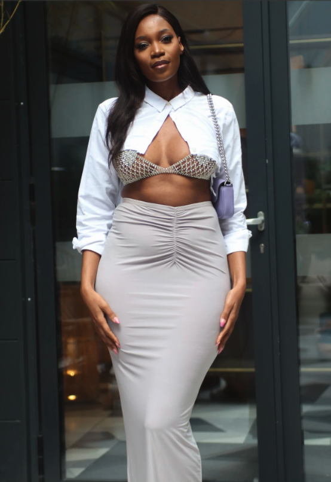

- Enjoy a seamless browsing experience on any device with responsive design, optimizing the event page layout for desktops, tablets, and smartphones.

## **Sign up Page**

On the Sign Up page, the website user finds an sign up form to submit interest of events . The user has to fill in their  details (required fields are checked using the `required` attribute) and can give additional information.

For this static website, the form uses the `POST` action instead of `GET` . 

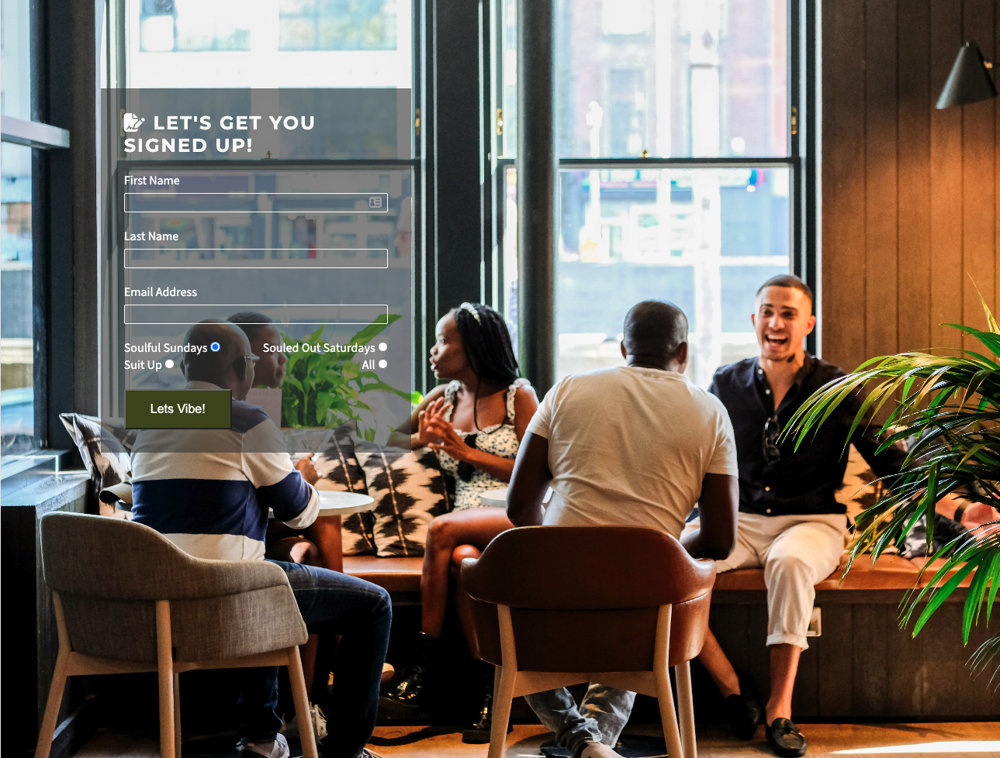

## **Custom 404 Page**

I added a custom 404 page to direct the user to a customized error page that is consistent with the website style.

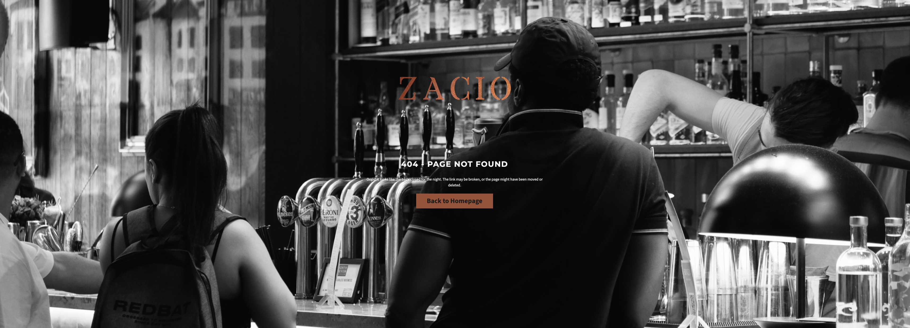

## **Future Enhancements**

I believe I added all the necessary features to create a minimum viable product that is ready to be used as a real-life website. However, there is room for improvement and further features. Here are some enhancements I would like to make in the future and to adapt this project for a real-world..

- The form on the sign up  uses a `POST`  parameter at the moment to simulate submitting the form. The form data would be sent to a database.
- I would fully build out an internal payment work flow instead of relying on Eventbrite to take these funds as they delay in payout .
- Will be adding 4d video recordings of the event

## **Testing**

### **Manual Testing**

I deployed the first version of my project after finishing the first iteration of the MVP. From this moment on I made sure to always test my live website. While implementing new features I had the website open in **Google Chrome**, resizing the browser using *Dev Tools*. I also opened the website on my phone and tablet after pushing new features. I think you get a better feeling for the mobile version of a website when opening it on a real phone, instead of a smaller browser window. Furthermore, I have **Microsoft Edge** and **Firefox** installed and made sure to open my deployed website there frequently.

I used the *#peer-code-review* channel on Code Institute´s Slack to get some feedback from other students. Got some good feedback on how to try improve the LCP which was the most challenging thing to bring up using the tool to compress the image.

### **Issues**

While coding some issues kept me thinking for longer than others. Below is a list of issues that took me a while to fix.

1. Getting a better performance on Lighthouse testing.
    - When I first ran the Lighthouse test my values for Perfomance *was at 69*.
        
        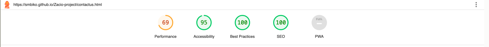
        
    
    - First I tried compressing the images again, but that did not change much. Then I converted them to the *.webp* format and changed the image size. As I had downloaded the images from [Iloveimg](https://www.iloveimg.com/) in their original size I was able to really size down my images this way.
        
        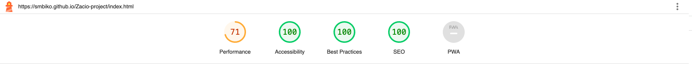
        

### **Validation**

### **HTML**

I used the [W3C Markup Validation Service](https://validator.w3.org/) to validate my HTML. I originally had some warnings because I had a spaces in between my image titles.

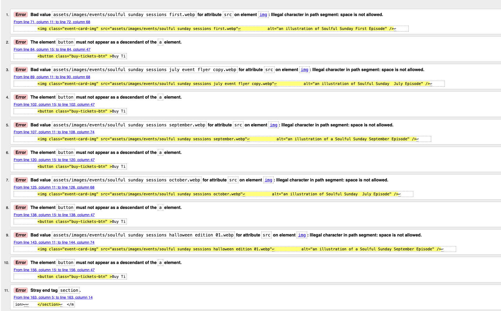

I then renamed the images and most of the errors were rectified . 

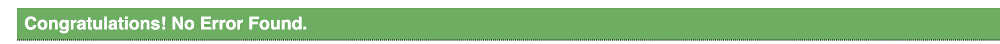

The full validation results can be found here:

- index.html(docs/wireframe/Testing/HTML Index page.pdf)
- events.html(docs/wireframe/Testing/HTML validator - events page.pdf)
- gallery.html(docs/wireframe/Testing/HTML validator gallerypage.pdf)
- signup.html(docs/wireframe/Testing/HTML validator signup.pdf)
- 404.html(docs/wireframe/Testing/htmlchecker404.pdf)

### **CSS**

I used the [Jigsaw CSS Validator] to validate my CSS. The validation came back with no errors or warnings. I validated the CSS by direct input and had a warning saying that some parts of the CSS can only be validated by URI. Imported style sheets are not checked in direct input and file upload modes
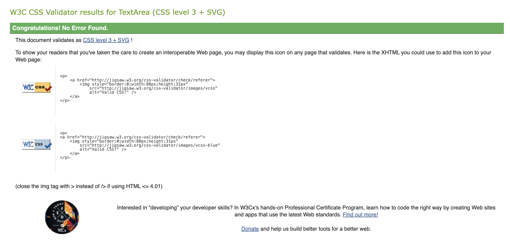

The full validation result can be found here.

### **Lighthouse Testing**

As described before in the Issues section, getting the *Performance* score on Lighthouse to a high level was probably the biggest challenge for me in this project.

I followed the recommendations I got in the Lighthouse tab and made some performance improvements that I already described. The score for *Performance* varies between 71 and 100 depending on the page, size and when I run the test.

### **Lighthouse Testing**

As described before in the Issues section, getting the *Performance* score on Lighthouse to a high level was probably the biggest challenge for me in this project.

I followed the recommendations I got in the Lighthouse tab and made some performance improvements that I already described. The score for *Performance* varies between 71 and 100 depending on the page, size and when I run the test. 

### **User Story Testing**

| User Story | Expected Result | Pass |
| --- | --- | --- |
| As a user, I want to navigate the website using multiple devices. | The website with all its pages is usable on big monitors, normal laptop screens, tablets and phones using different browsers and devices. | ✓ |
| As a user, I want to find general information about the events. | Types of events available and how to signup   | ✓ |
| As a user, I want to find out tickets available and purchase them. | There is a page on the website where all the tickets available for adoption can be found with relevant information about the event. | ✓ |
| As a user, I want to see pictures of events | Navigating the website there are many pictures of event attendees. | ✓ |
| As the site owner, I want to have people to sign up for interested events. | It´s ensured that the website user can find the type of events available and to sign up for future events notification | ✓ |

## **Deployment**

I followed my mentor's tip and deployed my website early, after implementing the header. The steps to deploying a website on GitHub pages are:

1. Open the [repository](https://github.com/smbiko/Zacio-project) and go to the **Settings** tab.
2. Navigate to the **Pages** tab in the left menu.
3. Choose **Deploy from a branch** and select the according branch, *main* in my case.
4. Click save. The link to the deployed website can then be found in the [repository](https://github.com/smbiko/Zacio-project) on the right menu under **Environments**.

The link to my live site is: [ZACIO](https://smbiko.github.io/Zacio-project/index.html)

## **Credits**

Thanks to my Code Institute Mentor Jubril Mentor for giving me valuable feedback and tips during this project.

### **Content**

- The content was written by myself and the images on the ZACIO page are from our past events .
- I adapted my hamburger menu from a video with the according [Codepen](https://codepen.io/kevinpowell/pen/jxppmr) from Kevin Powell.

### **Media and Design**

- The images used for the website are taken from my past events held in 2023 and compressed using [iloveimg](https://www.iloveimg.com/) .
- [Pixelied](https://pixelied.com/) was used to convert images to the *.webp* format.
- I used Figma to create Wireframes.
- With [colormind.io](http://colormind.io/) I created a color scheme and used [contrast-grid.eightshapes.com](https://contrast-grid.eightshapes.com/?version=1.1.0&background-colors=&foreground-colors=%23A06040%0D%0A%23212121%0D%0A%23454B1B%0D%0A%23FAFAFA%0D%0A%23EDEDED%0D%0A%23E1E2E4%0D%0A%23E1D6CC%0D%0A%237C756B%0D%0A%23736A63%0D%0A%23555454%0D%0A%233A3A3A%0D%0A%233F3D3D%0D%0A&es-color-form__tile-size=compact&es-color-form__show-contrast=aaa&es-color-form__show-contrast=aa&es-color-form__show-contrast=aa18&es-color-form__show-contrast=dnp) to check the contrast and possible color combinations.
- The fonts were downloaded from Google Fonts.
- The screenshot at the top of this document was taken from Am I Responsive?.